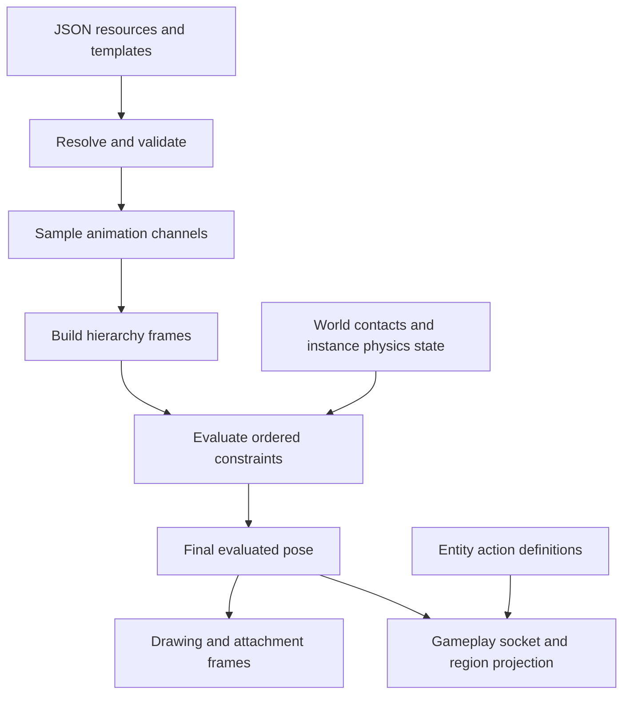

# Character resources and migration

Review and migrations: 2026-10-09. Resource-backed templates and the shared IK/contact layer are implemented. The later stages remain a proposed sequence.

Keep the existing authored pipeline and make its remaining assumptions explicit. Character Studio already has reusable model, animation, appearance and entity resources; replacing that pipeline would discard working authoring and playback behavior. The goal is that a new anatomy or content template needs data, while a new solver or rendering technique needs code.

## What exists

Before these changes, `Assets/Characters/authored` contained 5 models, 7 variants, 73 animations, 26 props and 10 entities. All five shipped models use point controls and IK chains. Their version 2 files are unchanged; the loader now adapts versions 2 and 3 to version 4 in memory. The affine/bone and image-slot paths are also implemented and tested, but none of those five models uses them.

| Concern | Current implementation | Remaining boundary |
| --- | --- | --- |
| Resource lookup | `AuthoredCatalog` scans folders and resolves IDs from JSON contents. | Specific game profiles still enumerate clip and equipment IDs in code. A folder or format identifier is a valid schema convention; a particular character's filenames should be content. |
| Rig | `CharacterModel`, `ResolvedModel`, `PoseEvaluator`: hierarchy, point controls, explicit bone frames, measures and sockets. | **Second migration implemented:** typed constraints and shared IK/contact evaluation, with separate compatible point and bone-frame solvers. |
| Templates | Previously selected by switches in `EditorSession` and `AssetBrowser`. | **Migrated in this change** to JSON recipes over existing models and clips. Build/proportion rules and appearance/entity presets remain code. |
| Animation | Separate clips; transform/target/socket-orientation tracks, contacts, markers, expressions, image attachments, slot colors and draw order. | One masked overlay is supported; a general layer stack, geometry deformation, image sequences and UV animation are separate features. |
| Appearance | Typed shapes/curves/materials, procedural parts, textured parts, slots/skins, props and local solid meshes. | `PuppetDrawing` currently requires image materials for slot-managed attachments. Shapes, images and props should eventually use the same attachment contract. |
| Contact | `ClipContact` and `ContactHold` operate on arbitrary constraint IDs and hold world anchors. Contacts now adapt to the shared pin operation. | A planted target is not a terrain query or a floor/wall collision solver. Surface queries, collision proxies and stateful simulation remain future operations. |
| Rendering | Orthographic XY projection with depth testing and local 3D prop orientation. `CharacterLayer2D` exposes depth as character order. | Slot order, continuous part depth and solid depth must retain their respective behavior when attachments are unified. |
| Gameplay | `EntityAsset` already owns equipment, actions, health, hit windows, damage, projectiles and movement/hurt shapes. | `PersonLoadout`, `PersonMoves`, controller vocabularies and the arena contain game/profile assumptions. Keep these above the reusable rig. |

Important code entry points:

- [Model and IK validation](../App2d.Core/Characters/Authored/CharacterModel.cs), [pose evaluation](../App2d.Core/Characters/Authored/PoseEvaluator.cs), [contact anchors](../App2d.Core/Characters/Authored/EntityAnimator.cs).
- [Drawing and the image-only slot restriction](../App2d.Core/Rendering/Characters/PuppetDrawing.cs), [orthographic renderer](../App2d.Core/Rendering/Characters/PointCharacterRenderer.cs), [world submission](../App2d.Core/Rendering/Renderer2D.Characters.cs).
- [Hardcoded Person proportions](../App2d.Core/Characters/Authored/PersonBuild.cs), [loadout](../App2d.Core/Characters/Authored/PersonLoadout.cs), [player clip bindings](../App2d/Presentation/Persons/PersonAnimationDirector.cs).

Names such as `left-arm`, `hips` and `sword-hand` are useful inside a human template. A general evaluator should only resolve references supplied by that template. Optional semantic bindings can map a humanoid tool's “left hand” role to an arbitrary control ID. A closed solver identifier such as `two-bone-ik` is also appropriate: JSON selects a tested implementation and supplies its parameters. Moving every literal into a constants class would not address the dependency problem.

## First migration: resource-backed model templates

Studio now reads `Assets/Characters/authored/templates/*.json`. Recipes reference existing authored resource IDs, so there is no second copy of the geometry or animation keys. The New menu is populated from these files. Person, Quadruped, Triceratops and Stalker are included; Empty remains a built-in blank document.

For example, a custom model with no human body parts can become a template:

```json
{
  "format": "app2d-model-template",
  "version": 1,
  "id": "oscillator",
  "name": "Oscillator",
  "description": "A machine rig with one repeating movement.",
  "model": "machine",
  "animations": { "swing": "source-performance" },
  "previewAnimation": "swing"
}
```

The example requires an authored base model whose ID is `machine` and a compatible clip whose ID is `source-performance`. IDs come from the documents; the filenames need not match. Reopen the workspace after adding or changing a recipe.

Creating `crank` from that recipe makes `crank` and `crank-swing` as independent unsaved documents. The animation map's **keys are new ID suffixes**, and its values are source clip IDs. `previewAnimation` names a suffix and is optional. Every clip used by the source model's motion sets must be included; creation reports an omitted dependency instead of leaving a broken reference. Several roles can still share one copied clip.

Creation uses the current source documents, including valid unsaved edits. It deeply copies geometry, materials, hierarchy, sockets, skins, groups, looks and animation data. It remaps only model/clip references and motion-set assignments. Control/slot/marker IDs, reference measures, contacts, depths and imported provenance retain their meanings. Texture paths continue to refer to shared images in the same authored root. The new model and its clips start together at structure revision 1.

All generated IDs, references and clips are checked before any drafts are inserted, including conflicts with files that failed to load. No source document or existing asset file is rewritten. Save all persists the new documents using the existing per-file atomic saves; it remains a sequence of saves, not a multi-file transaction. New Person models now include seven compatible starter clips, fixing the old creation path's motion sets pointing back to clips for the original Person model.

Template IDs have their own namespace, so template `person` can reference model `person`. Invalid recipes appear in the browser's unreadable-file diagnostics. A custom workspace can omit the templates folder; Empty still works. To use a recipe in another workspace, bring its source model, referenced clips and any images along with it. Templates are edited as JSON in this first step; a template inspector is not implemented.

This change does not replace the old content-generation commands. `PersonTemplate`, `QuadrupedTemplate`, `StarterContent` and the move generators remain explicit authoring/regeneration tools and test fixtures. Ordinary Studio model creation no longer calls the anatomy generators.

## Second migration: typed IK and contact evaluation

Model format **4** adds `constraints`. Formats 2 and 3 upgrade in memory when loaded. Saving a document writes the current format; loading does not rewrite files. The existing `chains` collection remains supported for point IK, and old animation `target` tracks and `contacts` keep their IDs and meanings. Recipes copy the new constraints along with their clips.

For example, this complete minimal model is a machine linkage with two rigid segments and an endpoint:

```json
{
  "format": "app2d-model",
  "version": 4,
  "id": "linkage",
  "name": "Linkage",
  "controls": [
    { "id": "beam", "length": 1, "transform": {} },
    { "id": "hinge", "parent": "beam", "length": 1, "transform": { "x": 1 } },
    { "id": "tool", "parent": "hinge", "transform": { "x": 1 } }
  ],
  "constraints": [
    { "kind": "two-bone-ik", "solver": "bone", "id": "reach",
      "root": "beam", "joint": "hinge", "end": "tool", "bend": 1 }
  ]
}
```

Attach shapes to `beam`, `hinge` or `tool` through the existing part frame binding. A `target` track on `reach` with offset `(-1, 1)` places the endpoint at `(1, 1)`; zero offset targets its resolved rest position. The default target frame is `locomotion`, and the default reference scale is `unit`. The selected endpoint can have its own length, artwork and descendants; only the first two controls supply the solved segment lengths. Studio creates this declaration with **Make IK constraint** when the selected endpoint follows two bones. The existing `AddChain` API still authors legacy point chains; JSON may also put a `two-bone-ik` entry with `solver: "point"` in `constraints` to adopt the typed collection without changing its behavior.

`CharacterModel.IkChains` presents both collections to authoring. `ResolvedModel.IkConstraints` fixes evaluation order: legacy chains first, then typed constraints, each in document order. IDs must be unique across both. Null/unknown kinds, unknown solvers, overlapping or nested writers and target frames moved by any constraint are rejected. This initial layer deliberately rejects dependencies it cannot solve; it does not imply support for an arbitrary iterative constraint graph.

`PoseEvaluator` still samples channels and masks and builds FK. It then supplies typed `RigIkTarget` operations followed by active `RigContactPin` operations to [RigConstraintEvaluator](../App2d.Core/Characters/Authored/RigConstraintEvaluator.cs). Other hosts can use this same graphics-free layer on an evaluated hierarchy. Contact activation remains half-open, with the held non-looping endpoint exception. The existing world-anchor callback runs only for fully held contacts; a masked action releases its pin toward the blended IK target before the solve. There is no persistent simulation state in this evaluator, so seeking and onion skins stay deterministic.

The point solver retains rest-distance lengths, translated descendants, rotation-only target frames and the old reach inset. Bone IK instead:

- Requires the joint and endpoint to meet their parent's declared +X tip. Both declared segment lengths must be at least 0.01. It uses the current scaled root/joint lengths and exact reach limits, so a fully extended rest pose stays straight and equal segments can fold onto their origin. A stable FK direction resolves the otherwise ambiguous fully folded pose, including reflected contact pins.
- Rotates the root and joint frames and propagates each change through descendants. Points, angles and matrices remain consistent for geometry, sockets and gameplay projection. Depth retains the existing convention: joint depth stays unchanged, while the endpoint and its descendants follow target depth. Socket offset units retain their existing rotation-only convention; this migration does not change the socket schema into an affine attachment.
- Supports uniform XY scale and reflection. Bend follows the root frame's handedness. Segment frames with shear, unequal axis magnitudes, collapse or world lengths below 0.01 produce a diagnostic naming the constraint and segment. Setup, variant and sampled poses are checked. Animation that crosses a collapsed scale is unsupported even if its endpoints are valid.
- Uses the full transform of a free target frame. Offsets are in that frame's local axes (with the selected reference-measure ratio applied); authoring uses the inverse transform when dragging. A collapsed target frame cannot be used. Locomotion-frame targets and contact offsets remain in model units.

The root's translation and supported scale can still be animated. Its rotation is owned by IK; direct transform tracks on the solved joint/endpoint remain disallowed, as with point chains. An endpoint's setup orientation and descendant animation travel with the solved joint. Bone length editing moves the connected IK joint to the new tip. A variant that independently pulls a joint away from a declared tip is rejected instead of silently changing the meaning of `length`.

Point-library retargeting and prototype motion conversion do not infer bone rotations yet; they report that limitation for a bone-constrained target model. Noodle's existing rest export can now receive a Studio bone constraint when its tips connect. A new Noodle check verifies that its exported bones and attachments match a known pose through this same solver. Noodle's procedural runtime and deforming skin remain future ports.

## One reusable rig, several ways to drive it

A joint should not need to become a different object type when switching from keyed motion to IK or physics. Separate the stable structure, what draws on it, and what drives it:

| Resource / component | Responsibility |
| --- | --- |
| Rig | Stable bone/control IDs, parent relationships, setup transforms, optional lengths, point bindings, sockets and semantic roles. |
| Geometry | Shapes, curves, point lists, rigid meshes and, later, weighted meshes. A point list describes geometry or sampled motion; it is not a competing skeleton type. |
| Material / image | Fill, outline, texture reference and tint. Add texture sequences or UV channels when implemented. |
| Attachment | Bind geometry/material or a prop to a frame; select visibility, skin and draw order. A rigid attachment moves with its frame; a deformable one needs explicit bindings/weights. |
| Animation | Tracks address declared controls, constraint parameters, slots and attachment/material channels. Whole-rig motion is a root track; independent motion uses masks/layers. |
| Constraint | A typed operation with explicit references, parameters, coordinate space, weight and ordering/dependencies. Examples: IK, pin/contact, angle/distance limits, path following and collision avoidance. |
| Template | A recipe producing independent assets. A variant remains the existing live reference to one shared base plus overrides. These are different reuse choices. |
| Entity / game profile | Selects a rig, movement and actions, loadout, hit shapes and damage rules. A sword's artwork does not need health or an AI controller. |

Keep `CharacterModel` as the compatible document envelope during migration. Geometry and materials can stay embedded until actual reuse calls for separate resources. There is no need to introduce a new package ecosystem or an expression language to start.



Constraints need a defined solve order and frame propagation. Updating an IK endpoint must also update the affected frames, descendants and attachments. A floor and a wall can be instances of the same surface constraint with different normals. Self-intersection needs chosen proxy shapes, collision masks and exclusions for connected bones; an iterative solve must balance those contacts with length/angle constraints and report residuals when they cannot all be satisfied. Automatically colliding every visible shape would constrain intentional overlaps and hide the real authoring controls.

Pure animation sampling must remain safe for seeking and onion skins. Stateful physics belongs to each rig instance at a fixed time step, with explicit initialization/reset and a defined replay or bake policy for seeking. Constraints may consume a world-query interface; they should not directly know the side-scroller or editor. Decorative secondary motion can remain presentation-only, while anything controlling hit regions needs an explicitly shared authoritative evaluation path.

## Why Noodle is separate today

Noodle contains three experiments, not just another frontend for Studio:

- `--bones`: `RigDocument2D` and the WinForms bone/shape editor. Its one-way [bridge](../App2d.Noodle/Rigging/RigAuthoredBridge2D.cs) exports a rest model at 100 pixels per authored unit. Both paths share `BoneFrame2D`; this is already a partial integration.
- `--rigid`: `StandardSkeleton2D`, `RigidPose2D`, `PoseClip2D`, procedural locomotion and rigid/spline artwork. The skeleton's anatomy and proportions are fixed in code and this mode has its own pose/animation representation.
- `--prototype`: `NoodleArm2D` and `NoodlePerson2D`, including a width-reconstructed skin around a two-bone solve. That deformation technique has not been made into a reusable Studio attachment.

The projects already share Core's IK/math, shapes, rendering and constraint projection functions. Distance/axis/polar projectors are wrappers around Core math, not three new full physics solvers. The duplication is primarily document representation, pose orchestration, content and parts of skin generation.

The bone bridge exports neither animation nor constraints/physics. Collision-only shapes become hidden artwork, not gameplay colliders, and alpha is omitted. Keep those limits explicit during import. Bring Noodle's useful deformation and authoring interactions onto the shared rig/attachment contracts, then make the demos consume that runtime. Retain the demos as useful test hosts; retire duplicate pose engines only after parity checks pass. See [the existing bridge notes](rig-bridge.md).

## Remaining migration sequence

| Stage | Concrete change | Compatibility gate |
| --- | --- | --- |
| 1 — implemented | Data-backed model templates and dependency remapping. | Existing resource files stay unchanged; new bundles save/reopen independently; source and copy poses match. |
| 2 — implemented | Typed IK resources, shared target/contact operations, compatible point evaluation and bone-frame IK with explicit scale/reflection rules. | 18,225 captured legacy samples match exactly; bone tests cover frames, attachments, contact release, reflection, reach boundaries, saving and editing. |
| 3 — attachments | Let slots bind procedural geometry and props as well as images. Add data-backed attachment selection/socket switching. | Preserve part depths, slot timelines, weapon grip/tip projection, skin fallback and both facings. Keep texture swaps distinct from future UV/deform support. |
| 4 — profiles | Move Person loadout IDs, source mappings, proportion bindings and player clip assignments into explicit templates/profiles. Retain specialized controllers behind named capabilities. | Existing player moves, clothing, sheathing, attacks, hit timing and enemy behavior still match. Gameplay owns damage; rendering remains observational. |
| 5 — Noodle | Make bone editing use the shared document; adapt rigid/procedural clips and port noodle skin generation as a reusable attachment/deformer. | Bridge rest/rotation checks plus matched samples for each demo; preserve originals until conversion is reviewed. |
| 6 — extensions | Add floor/wall queries, self-collision, secondary physics, weighted meshes and richer animation layers as independently testable features. | An arbitrary machine/creature rig exercises each feature without requiring human part names. Define editor seeking behavior before adding physics. |

Preserve stable IDs, motion reference measures, coordinate conventions, interpolation/easing, contact endpoints, draw order and action timing. Load-time adapters should not rewrite source assets. Any later on-disk conversion should target a copy first, report unsupported data, and pass save/reopen plus pose/region/render comparisons before replacing originals.

Useful existing validation includes authored catalog/pose/entity tests, bone and Spine/slot tests, `App2d.Noodle --check`, and Studio's editor/motion/entity/weapon/wardrobe smoke modes. Automated pose parity complements image comparisons: neither alone covers both contact/gameplay behavior and occlusion.

## Validation of the template migration

- Baseline: all 1,368 existing tests passed before the change.
- The five-project solution builds. The 39 focused template, editor-session and quadruped tests pass, including 19 new template cases.
- Final full regression run: **1,387 passed, 0 failed, 0 skipped**. An earlier full run failed the unchanged `MusicPerformanceTests.ZoneUpdatesAndSelectionsAllocateNoManagedMemoryAfterWarmup` allocation assertion (7,872 bytes versus zero). It passed in isolation and in the final full rerun; no audio code or test thresholds were changed.
- Noodle's deterministic `--check` passed both the rigid prototype and authored rig bridge checks.
- Studio's `--smoke-editor` passed 44 checks and produced 33 frames on a fresh scratch workspace. The copied Triceratops model and rush animation frames were also inspected visually.
- Git inspection confirmed no changes to existing model, variant, animation, prop or entity resource files. Only the new `templates` resource folder was added to the character library.

The local smoke output and regression report are under `artifacts/character-resources-20261009` (ignored build artifacts).

## Validation of the constraint migration

- The five-project solution builds. Final regression run: **1,424 passed, 0 failed, 0 skipped**, including 37 new cases for constraints and exact IK geometry.
- Before modifying the evaluator, a local harness captured **18,225** pose fingerprints across every shipped model/variant and compatible clip. Samples cover repeat/clamp, contact boundaries, in-place motion, a held-target callback, reversed channels and partial/full masks. After the final changes, every fingerprint matches exactly, including points, angles, bone matrices, socket orientations and constraint/contact results.
- Bone cases check analytical segment positions, attachment and descendant propagation, socket orientation, uniform scale, all reflection combinations, fully extended/folded configurations, unreachable targets, contact release, inverse target authoring, seeks, length edits, template copying, strict JSON parsing and editor save/reopen/undo. Unsupported frames and competing writers produce explicit errors.
- Noodle's deterministic `--check` passes, including a newly added exported linkage that uses the shared bone constraint evaluator and matches Noodle's known bone/shape transforms.
- Studio's final `--smoke-editor` passes **48 checks** and renders **36 frames** on a fresh scratch workspace. The new linkage workflow creates a typed constraint, keys it, plants it and saves/reopens it. Rest and animated frames were inspected visually.
- Git whitespace checks pass. No existing model, variant, animation, prop or entity resource file was rewritten.

Local evidence is in `artifacts/rig-constraints-20261009`: the parity harness and baseline, `tests/regression-final.trx`, and `editor-final/editor-smoke.txt` with rendered frames. These are ignored artifacts; the automated constraint and Noodle checks remain in source.
